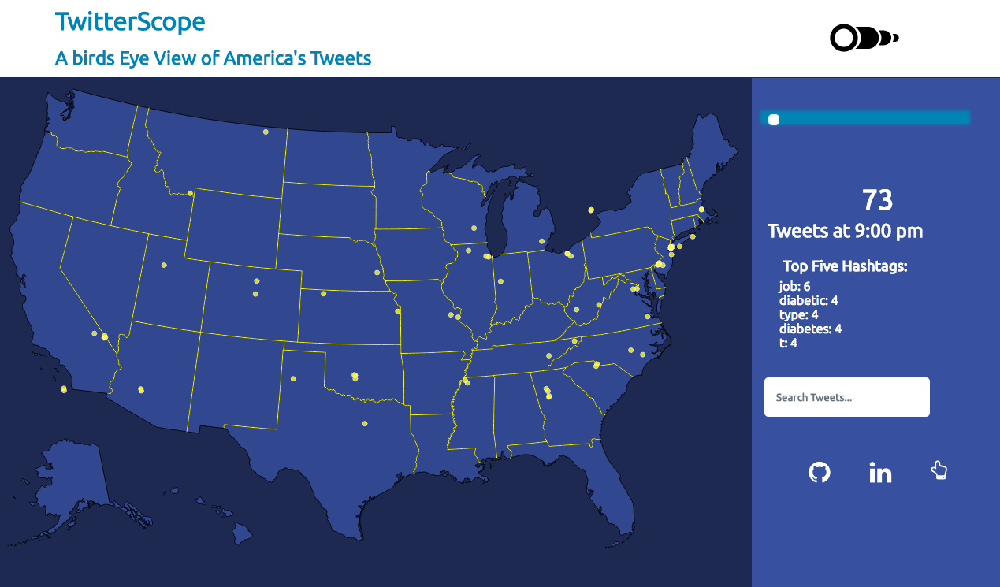

# TweetScope

<a href="https://jamievers.site/TweetScope">Live Demo</a>

TweetScope is a data visualization application for exploring random samples of Twitter microblog posts over the course of one day. It was built with <a href="d3js.org">d3.js</a> and utilizes data scraped from the <a href="https://dev.twitter.com/streaming/overview"> Twitter streaming API</a>. 

# Current Features & Implementation Details

## Adjustable Timescale and Dynamic Rendering
Slider functionality allows the user to view tweets on the map according to the hour at which they were created, the map re-renders dynamically as the slider is moved.

## Content Search

Users can search through all stored tweets, queries by hashtag and keyword will return results.

## Trending Hashtags

TweetScope features a 'microtrending' display for each hour that tweets were collected, displaying the top five hashtags with the highest frequency count 

## Hover Tooltips

Users can examine the actual content of tweets by hovering over the geo-coordinates of an individual tweet on the map

# Hopes and Dreams: 
Plans for future development include:
- [ ] Write additional functionality that allows the user to watch tweets render live
- [ ] Design backend functionality and distributed systems for richer information via more data
- [ ] Allow users to click links contained in Tweets
